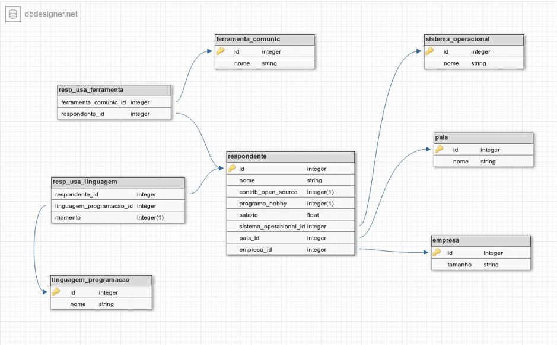
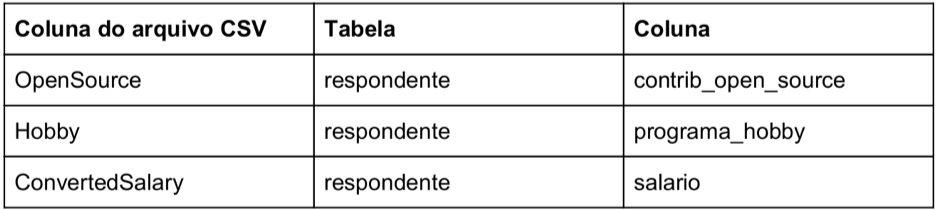
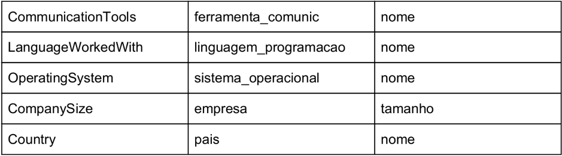
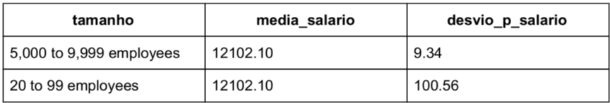
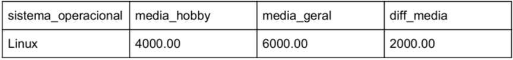
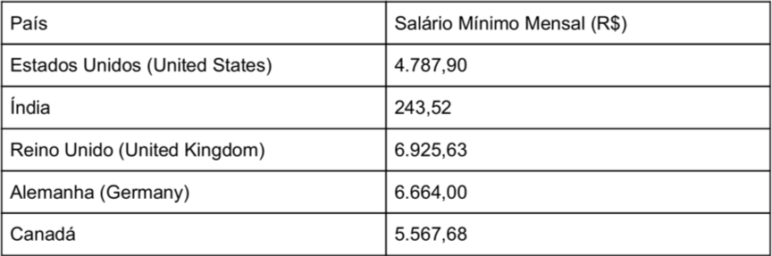
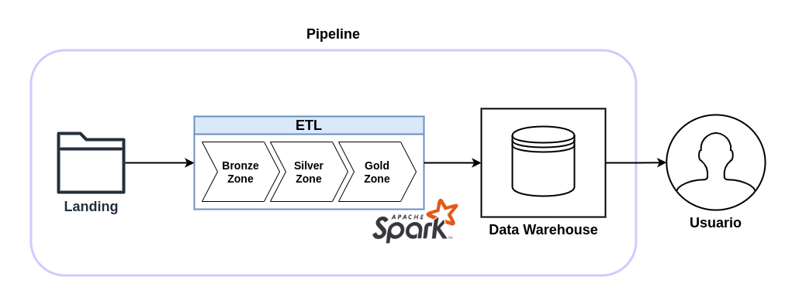

# AME - Data Engineer

## Desafio

**Propósito**

Este desafio tem como objetivo avaliar sua forma de resolver problemas. Ao solucioná-lo, você nos mostrará:

-   Sua capacidade de articular questões de negócios em consultas ao banco de dados.
-   Sua capacidade de extrair dados de uma fonte, processá-los e salvar em uma nova fonte.

**Sobre o desafio**

O Stack Overflow é uma plataforma amplamente conhecida na comunidade de tecnologia e permite que usuários façam perguntas e também as respondam. Além disso podem, através do registro e da participação ativa, votar em questões e respostas mais ou menos úteis.

Provavelmente você já o acessou para sanar dúvidas de código que tinha.

Todo ano o Stack Overflow faz uma pesquisa com sua comunidade de desenvolvedores sobre vários temas, que vão desde as suas preferências tecnológicas até questões profissionais. E nós estamos super curiosos para saber o que os desenvolvedores andam falando por aí. Queremos saber quais tecnologias usam, como se comunicam, quanto ganham em média, onde moram e mais algumas coisas.

Seu desafio é nos ajudar a responder essas perguntas usando os resultados da pesquisa aplicada em janeiro de 2018. Dividimos o desafio em duas partes principais:

            1. Popular um banco de dados a partir dos dados crus da pesquisa (nós já te daremos a estrutura do banco de dados)

            2. Realizar consultas no banco de dados para matar nossa curiosidade

**Montagem do banco de dados**

Nós te daremos um arquivo de texto (formato CSV) contendo uma parte dos resultados da pesquisa realizada pelo Stack Overflow e outro arquivo texto (formato CSV) contendo a descrição das colunas de respostas presentes no primeiro arquivo (ou seja, ele te fala quais perguntas foram feitas e que geraram as respostas).

Você vai usar uma linguagem de programação para ler esse arquivo, processá-lo de acordo com as regras de negócio descritas abaixo e depois inserir esses dados em um banco de dados de sua escolha (vide seção Stack de Tecnologias).

Nós te daremos o modelo Entidade Relacionamento do banco de dados, mas caberá a você montar o código SQL que implementa esse modelo no banco.

**Fonte de dados**

Você encontrará no anexo desse projeto dois arquivos, o primeiro dos quais contém uma amostra de apenas 10 mil linhas de respostas à pesquisa, e o segundo, uma explicação do significado das colunas de respostas.

O primeiro arquivo se chama [base_de_respostas_10k_amostra.csv](base_de_respostas_10k_amostra.csv) e o segundo, [base_de_conhecimento.csv](base_de_conhecimento.csv). Caso queira ver os resultados completos da pesquisa, basta acessar esse [link do Kaggle](https://www.kaggle.com/stackoverflow/stack-overflow-2018-developer-survey).

**Estrutura do banco de dados**

A imagem abaixo contém a estrutura do banco de dados que você vai implementar. Você também pode acessar a imagem em tamanho maior no arquivo *mer-summer-job.png* , que está em anexo no projeto.

A tabela abaixo faz um mapeamento dos campos do arquivo CSV para as tabelas do banco. Dessa forma, você saberá exatamente o que buscar e analisar:

**Regras de negócio**

- Salário vazio ou com valor "NA" deve ser convertido para zero (0.0).

- Salário deve ser sempre calculado em reais e mensal. Para esse cálculo você usará a coluna *ConvertedSalary*, que contém o salário anual. Considere que 1 dólar equivale a R$3,81.

- O nome dos respondentes deve seguir a regra *respondente_[número]* . (ex: *respondente_1,* *respondente_2*, *respondente_3*). O critério de geração desse número é todo seu.

- Cada linha da tabela *linguagem_programacao* deve conter uma única linguagem de programação.

- Cada linha da tabela *ferramenta_comunic* deve conter apenas uma ferramenta de comunicação.

É importante notar que em alguns campos de respostas existem múltiplos resultados, como por exemplo na coluna *LanguageWorkedWith*, que contém várias linguagens de programação em uma linha. Nestes casos, você deve quebrar a string nos pontos que existem ponto-e-vírgula (";").

**Perguntas a serem respondidas**

Com sua estrutura do banco pronta, você poderá realizar consultas SQL no banco que você criou e matar nossa curiosidade. A lista abaixo contém tudo que precisamos saber:

1. Qual a quantidade de respondentes de cada país?

2. Quantos usuários que moram em "United States" gostam de Windows?

3. Qual a média de salário dos usuários que moram em Israel e gostam de Linux?

4. Qual a média e o desvio padrão do salário dos usuários que usam Slack para cada tamanho de empresa disponível? (dica: o resultado deve ser uma tabela semelhante a apresentada abaixo)

5. Qual a diferença entre a média de salário dos respondentes do Brasil que acham que criar código é um hobby e a média de todos de salário de todos os respondentes brasileiros agrupado por cada sistema operacional que eles usam? (dica: o resultado deve ser uma tabela semelhante a apresentada abaixo)

6. Quais são as top 3 tecnologias mais usadas pelos desenvolvedores?

7. Quais são os top 5 países em questão de salário?

8. A tabela abaixo contém os salários mínimos mensais de cinco países presentes na amostra de dados. Baseado nesses valores, gostaríamos de saber quantos usuários ganham mais de 5 salários mínimos em cada um desses países.

**Stack de tecnologias**

O nosso time é muito diversificado em termos de tecnologia. Para esse projeto especificamente, selecionamos a seguinte ​ stack ​ de tecnologias para você usar:

- **Linguagem de programação**: qualquer linguagem gratuita (sugestões: Python, Java, Scala, Ruby)

- **Banco de dados:** qualquer banco de dados relacional gratuito (ex: MySQL, PostgreSQL, SQLite, MariaDB, etc.)

- **Linguagem para consulta ao banco de dados:** SQL

Sabemos que há muito código disponível na internet e que muitas vezes eles nos ajudam a resolver desafios que enfrentamos ao desenvolver projetos. **But, be careful!** Queremos conhecer bastante o código que você é capaz de desenvolver, usando sua capacidade analítica e criatividade. Não esperamos um código específico para resolver esse desafio, mas sim que ele reflita seus conhecimentos.

Fique à vontade caso queira utilizar alguma IDE para modelar o seu banco de dados, ou seja, criar sua estrutura de tabelas. É interessante apenas que você deixe isso claro no seu relatório final.

**O que esperamos ver ao final?**

Nosso time está curioso para ver o seu projeto. Esperamos que seu entregável final contenha os seguintes ítens:

1. Um arquivo de introdução nos explicando a visão geral do seu projeto e quais tecnologias utilizou (ex: PostgreSQL 9.6).

2. Um arquivo contendo as respostas das questões que fizemos acima.

3. As consultas SQL que você realizou no banco para responder as perguntas.

4. Os arquivos com o seu código utilizado para ler os arquivos textos e publicar os dados no banco.

_________________________________________________________

## Resolução

### Stacks
Para realizar a extração dos dados proveniente do arquivo fonte [base_de_resposta](base_de_respostas_10k_amostra.csv) foram utilzadas as seguintes stacks:
- Pyspark (Python);
- SQL spark (SQL);

### Pipeline
O [pipeline](imagens/pipeline_ame.png) desenvolvido tem como propósito fornecer um data warehouse (DW) com as tabelas dimensões e fato estabelecidas pelas regras de negócio.
Em nosso pipeline, os dados brutos são extraídos da pasta [landing](pipeline/landing/) e posteriormente são adequados via processo de ETL, divididos em 3 etapas. Por fim, os dados pós ETL são transferidos para o database (ame_digital) no data warehouse e disponibilizados para análises exploratórias.

O processo de ETL é dividido em 3 zonas:
- [Bronze Zone](pipeline/bronze/);
- [Silver Zone](pipeline/silver/);
- [Gold Zone](pipeline/gold/);

Na bronze zone, os dados brutos são copiados de maneira integra, incremental e os schemas são definidos de maneira genérica, onde o arquivo dessa zona será a referência para o nosso ETL. Na silver zone, os dados mais recentes sofrem os seguintes processos: limpezas e transformações pertinentes. Além disso, os schemas dos campos transformados e dos campos originais são definidos de maneira criteriosa. Após as transformações, são gerados os dados da [gold zone](pipeline/gold/). Aqui, os arquivos armazenados correspondem as tabelas definidas pela regra de negócio. Por fim, os arquivos refinados da gold zone são transferidos para o DW, compondo os dados de todas as tabelas. 

### ETL
As transformações ([silver zone](pipeline/silver/)) aplicadas aos dados brutos foram: converter a nomenclatura dos campos de *Pascal case* para *Snake case*; tratamento de valores **null** para os campos: country, company_size, operating_system, communication_tools e language_worked_with. Para o caso de valores *null* no campo country, os respectivos dados foram descartados devido a inexistencia de informações (*null*) nos outros campos. Nos demais campos tratados, os valores *null* foram substituidos pela classificação *Others*, pois os respectivos respondentes: representavam aproximadamente 10% do total, responderam/continham informações nos demais campos; logo (o valor *null*) pode ser entendido como desatenção durante o prenchimento ou falta de opções para preencher determinado campo.

### Data Warehouse

As tabelas do DW seguem a regra de negócio determinada pelo projeto e contém os dados presentes nos arquivos da [gold zone](pipeline/gold/). A criação do database *ame_digital*, definição dos campos, suas tipagens nas tabelas e a transferência dos dados da gold zone para o DW foram realizadas com queries SQL via engine do spark. Os dados disponibilizados aqui foram utilizados analisar os dados tratados e responder aos questionamentos formulados no [desafio do projeto](/challenge_ame.ipynb).

### Análise dos dados

Para essa etapa, preferimos utilizar queries SQL via engine do spark para explorar todas as duvidas presentes neste desafio. As respostas das queries são apresentadas no formato tabular após a execução de cada célula do [arquivo **ipynb**](/challenge_ame.ipynb). 